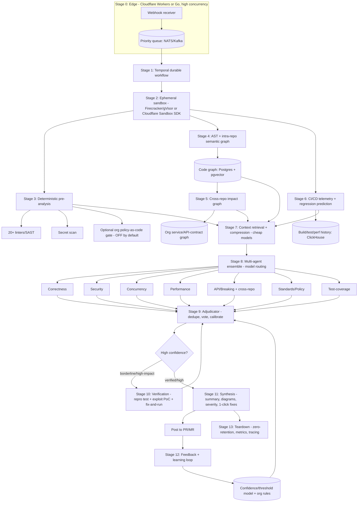

# Cavix — The Complete Product & Business Roadmap (v3, Market-Updated)

> **The name is now chosen: Cavix.** Brand **Cavix**, domain **cavix.ai**, social/GitHub handle **@CavixCode**, legal entity **Cavix, Inc.** (or **Cavix AI, Inc.**) at incorporation. It sits in the short, Latin-flavoured, ownable dev-tool register (Vercel / Datadog / Sentry vibe) — easy to say on a podcast, easy to spell on a phone, and not tied to a literal English word you'd fight a dozen others for. **One open item before you print anything:** run the §16 clearance checklist (USPTO/EUIPO/India trademark in software class 9 + SaaS class 42, npm/PyPI/GitHub org handles, a quick Hindi/major-language meaning check). Choosing `.ai` over `.com` is defensible for an AI dev tool, but try to secure `cavix.com` defensively if it's affordably available. Until the trademark knockout search is clean, treat the name as *chosen but not yet legally cleared.*
>
> **What changed in v3 (read this):**
> 1. **Pillar 3 (the hardcoded OWASP/CWE "compliance core") is removed as a headline differentiator.** You're not building an OWASP product. The cheap deterministic layer (linters + secret-scanning) stays because it's free signal everyone runs; the OWASP/policy piece is **demoted to an optional, org-configurable policy-as-code gate that ships OFF by default** and is not security-branded. Pillars go 8 → 7.
> 2. **The market section is rebuilt on June-2026 data** (ARR, funding, benchmarks) gathered from current sources — because the field moved hard since v2.
> 3. **Three competitors that did not exist as threats in v2 are now front-and-center:** Anthropic's own **Claude Code Review** (launched 9 Mar 2026), **Cursor BugBot** (post-Graphite acquisition, 2M+ PRs/mo), and **Macroscope** (autonomous verified fixes). The strategy is updated to survive them.
> 4. **New sections:** per-competitor gap→robustness map (§3b), the **retention engine** (§14), an honest **unicorn verdict** (§15), the **naming shortlist** (§16), and a **week-by-week launch plan** (§10b).
> 5. **The Cloudflare question is answered** in §7b, and the "security breach is impossible" framing is corrected to the honest engineering posture.
>
> Read the **"Why this matters"** notes — they teach the reasoning, not just the instruction.

---

## Table of contents
1. Market reality (June 2026 data) & the one gap that matters
2. Product thesis & the seven pillars
3. Competitive matrix — how you beat each rival
3b. **Per-competitor gap → how Cavix is robust to it (the part you asked for)**
4. Reference architecture (the whole machine on one page)
5. The complete mechanism, stage by stage
6. Raising benchmark scores & testing against competitors
7. Technology stack (MVP vs production)
7b. **Cloudflare Workers / Containers — should you use them? + the honest security posture**
8. Build roadmap — phases with exit gates
9. Pricing, subscriptions & BYOK economics
10. Go-to-market & the word-of-mouth engine
10b. **The launch plan, week by week (from Week 1)**
11. Fundraising — which VCs, what to show
12. Winning the giants (TCS, Infosys & global SIs)
13. Metrics, team, risks (incl. the platform-risk reality)
14. **The retention engine — engineering very high retention**
15. **Unicorn potential — the honest verdict**
16. **Naming — a fresh shortlist + how to clear it**
17. The 12-month critical path

---

## 1. Market reality (June 2026 data) & the one gap that matters

**The category is real, large, and growing fast — but crowding hard.**
- Narrow "AI PR review" market ≈ **$400–600M ARR** in 2026, growing **30–40% YoY**. The broad "code quality + security + assistants with review" market is **$2–3B**, on pace for **~$5B by 2028**.
- VC poured **$1.2B+** into AI-code-review startups between Jan 2024 and Dec 2025.
- **Adoption is still early:** ~44% of teams use an AI reviewer on *at least some* PRs — so most of the market is unbought.

**The current scoreboard (so you know exactly who you're fighting):**
- **CodeRabbit** — the mid-market default. ~$40M ARR (Apr 2026, +700% YoY), $60M Series B at a **$550M valuation** (Sep 2025, $88M raised total), 8,000+ paying customers, 13M+ PRs, 2M+ repos. Strength: polished, broadest platform support (GitHub/GitLab/Bitbucket/Azure), best free tier, strong *precision*. Weakness: **diff-only** (weak cross-file/architectural), noise on big PRs, ~7-day retention, self-host is Enterprise-only.
- **Greptile** — the depth specialist. ~$25–30M Series A (Benchmark), 2,000+ customers (Brex, Substack), low-tens-of-millions ARR. Strength: whole-codebase context, highest *raw catch rate* (claims ~82%). Weakness: **noisy** (most false positives in head-to-heads), GitHub/GitLab only, BYOK enterprise-only, **no enterprise logos yet** per spend-panel data.
- **Qodo** (ex-CodiumAI) — the governance/test-gen play. Strength: multi-agent, **cross-repo dependency tracking** (Enterprise), auto test-gen, air-gapped, SOC 2, open-source PR-Agent core. Weakness: credit-system friction, **net switching is AWAY from Qodo toward CodeRabbit**, cross-repo locked to Enterprise.
- **GitHub Copilot Code Review** — GA Mar 2026, bundled into Copilot Business ($19) / Enterprise ($39). The **commodity floor**: zero procurement, auto-on for any Copilot org. Weakness: light customization; teams still pair it with a "real" reviewer.
- **Cursor BugBot** — post-Graphite-acquisition (Dec 2025), **2M+ PRs/mo**, $40/user, Autofix spawns cloud agents in their own VMs. Strength: quiet/precise, ecosystem pull. Weakness: GitHub-only, expensive, "the company that wrote your code now reviews it."
- **Macroscope** — usage-based **~$0.95/review**, **"Fix It For Me"** (branch → commit → PR → run CI → self-heal) and **"Approvability"** (auto-approves low-risk PRs). Tops one independent benchmark (48%). **This is the closest thing to your Phase-4 vision already shipping.**
- **Claude Code Review (Anthropic)** — launched **9 Mar 2026**, multi-agent, GitHub, token-based **$15–25/PR**, Team/Enterprise. Built by the same company whose model you default to. (See §13 platform risk.)
- **Sourcegraph (Cody)** — enterprise category leader on the buy-side panel; review is a feature of a bigger code-intelligence platform.
- Also live: **Sonar/Semgrep/Codacy** (rule-based SAST/quality, trusted but not contextual), **CodeAnt**, **Nullify** (narrow security), **Sourcery** (Python-first), **Optibot/Bito/Ellipsis** (newer entrants).

**The benchmark reality (important — v2 over-promised here):** the independent numbers *conflict by source*. Macroscope's benchmark: Macroscope 48 / CodeRabbit 46 / BugBot 42 / Greptile 24. Greptile's own: 82% catch. Martian 2026: CodeRabbit ~49% precision (ranked #1 there). **Takeaway:** "be #1 on Martian at >70% F1" is a *marketing aspiration, not a plan*. Pick **one** independent benchmark, commit to its methodology publicly, and win it honestly — and treat your **own action-rate metric** (below) as the real compass.

**The one gap that still matters: TRUST.** Across every source, the recurring complaint is *noise* → developers mute the bot → churn. Nobody is simultaneously high-recall, high-precision, and **trusted enough not to be muted.** That gap is your wedge. Everything below serves it.

**Why this matters:** CodeRabbit's success isn't a secret model — it's orchestration (queues, microVM sandbox, 40+ linters, dep-graph, compression models, learning loop). That means the moat is *engineering*, and engineering moats can be out-built — but only if you attack a dimension the incumbents structurally lack, not the dimension they already won (raw reviewing).

---

## 2. Product thesis & the seven pillars

### One-sentence positioning
> **Cavix is the AI code reviewer that proves its findings before it speaks** — it reproduces the bug (or the exploit) in a sandbox, applies the fix, and runs the tests, so its comments are verified facts, not guesses. It understands your whole estate (cross-repo), predicts operational regressions (CI/CD telemetry), runs anywhere (BYOK-first, self-hostable, air-gapped), and gets more tuned to your team the more you use it.

### The seven pillars
*(v2's Pillar 3 — the hardcoded OWASP/CWE compliance core — has been removed as a named differentiator. The deterministic linter/secret layer remains as cheap signal in Stage 3; OWASP/policy enforcement survives only as an **optional, off-by-default org policy-as-code gate** folded into Pillar 7. Cavix is positioned as a **trust-first reviewer**, not a compliance/SAST product.)*

1. **Execution-grounded verification (the moat).** Prove bugs *and* security vulnerabilities by reproducing them in a sandbox; surface only verified or high-confidence findings. *Kills the noise that caps everyone and is the reason developers won't mute you.*
2. **Cross-repo / microservice impact graph.** Model the org's services, API contracts, shared libs, and schemas; when a PR changes a public interface, trace downstream consumers in *other* repos and flag breakage in real time. *Note: Qodo Enterprise now does a version of this — so your edge is doing it **on every tier and verified**, not "being first."*
3. **Whole-repo semantic graph (persistent, incremental).** Symbols, call graph, data-flow, types, history — context for cross-file reasoning. Matches Greptile's depth; the verification layer (1) removes Greptile's noise.
4. **Multi-agent ensemble + adjudication + calibrated confidence.** Specialized parallel agents, voting, per-org thresholds. *Note: Anthropic, Qodo, and Cursor all ship multi-agent now — so this is table stakes you must match, not a differentiator on its own.*
5. **CI/CD telemetry & regression prediction.** Ingest historical build/test/perf data; warn when a PR will likely introduce a build-time or runtime regression *before merge*. **Genuinely empty lane — nobody in the set does this.**
6. **BYOK-first, model-agnostic, self-hostable/air-gapped (the enterprise wedge).** The path into banks, defense, and Indian IT services that *cannot* send client code to third-party SaaS. Also your hedge against platform risk (see §13).
7. **Learns your codebase + standards; legacy + modern breadth; modernization mode.** Accept/reject learning loop (the compounding, data-driven moat), COBOL/PL-SQL/.NET legacy *and* modern stacks, verified migrations, **and the optional deterministic org-policy gate** for the regulated buyers who want one.

**Why this matters:** These pillars are a *coherent machine*, not a feature grab-bag. The graph (3) feeds the impact analysis (2); the telemetry (5) feeds the performance agent (4); the verification (1) is what makes every other finding *trustworthy enough to act on*; the learning loop (7) calibrates the whole thing to each team. Your two genuinely-open lanes are **(1) verification-as-a-review-filter** and **(5) telemetry regression prediction** — concentrate differentiation there, and treat (3)(4) as parity you must achieve to be taken seriously.

---

## 3. The competitive matrix — how you beat each rival

| Competitor | Their real mechanism (2026) | Where it's weak | How Cavix wins |
|---|---|---|---|
| **CodeRabbit** | Queue → microVM sandbox → 40+ linters + dep-graph → compression models → frontier reasoning → learning loop | Diff-only (weak cross-file), noise on big PRs, no BYOK, ~7-day retention, self-host Enterprise-only | Verification removes noise; cross-repo + telemetry add reach; BYOK/zero-retention/air-gapped on every tier |
| **Greptile** | Whole-repo graph; multi-hop investigation (Claude Agent SDK) | Noisy (most false positives), GitHub/GitLab only, BYOK enterprise-only, no enterprise logos yet | Same graph depth **plus verification** = depth *without* the noise; broader platforms; self-host |
| **Qodo** | Multi-agent + test-gen; **cross-repo dep tracking (Enterprise)**; PR-Agent OSS core | Credit-system friction; cross-repo locked to Enterprise; net churn toward CodeRabbit | Verified findings; cross-repo on **every** tier; telemetry; trust-first positioning |
| **GitHub Copilot Review** | Bundled into Copilot Business/Enterprise; repo-aware via Copilot index | Light customization; "good-enough" floor; GitHub-centric | Win where a bundled commodity can't go: verification, cross-repo, self-host/air-gapped, legacy |
| **Cursor BugBot** | Multi-pass + voting; Autofix in cloud VMs | GitHub-only, $40/user, code-author-reviews-own-code conflict | Independent reviewer; verification proof; broader platforms; BYOK |
| **Macroscope** | Usage-based; autonomous fix + CI self-heal + auto-approve | Autonomy without a *prove-before-surface* gate; trust ceiling on auto-merge | Same autonomy **gated by verification** — you only ever act on proven findings (safer to adopt) |
| **Claude Code Review** | Anthropic multi-agent, token-priced | GitHub-only, no free tier, expensive/PR, Anthropic-model-locked | Model-agnostic + BYOK (incl. *running on Claude* if they want), free OSS tier, self-host, cross-repo |
| **Sonar / Semgrep / Codacy** | Mature rule engines, quality gates, SAST | Rule-bound, not contextual, heavy setup | Embed their *class* of rules as the optional deterministic layer, then add reasoning + execution proof |
| **CodeAnt / Nullify / Sourcery** | Code-health / security-narrow / Python-first | Early, narrow, thin moat | Broader correctness+security+perf, all **proven** in sandbox; legacy breadth |
| **Graphite (now Cursor)** | Stacked-PR workflow | Workflow, not deep review | Integrate with stacked PRs; out-review them |

**Why this matters:** You don't beat a dozen funded companies with "a better prompt." You inherit the *proven pipeline shape* (so you match their throughput and signal-to-noise) and bolt on the two stages the whole field structurally lacks — **proof (verification)** and **operational foresight (telemetry)** — plus the **deployment freedom (BYOK/self-host/air-gapped)** that the bundled commodity players (Copilot, Claude Code Review, Cursor) can't follow you into.

---

## 3b. Per-competitor gap → how Cavix is robust to it

This is the section you asked for: each rival's *exploitable* weakness, and the concrete mechanism that makes Cavix immune to the same complaint. Build to this table and you are hard to dislodge.

| Rival's gap (their #1 churn/complaint driver) | Cavix's structural defense |
|---|---|
| **CodeRabbit / Greptile: noise → developers mute the bot** (the universal complaint) | **Verification gate (Stage 10)** — a non-reproducing finding is *discarded*, not posted. Plus aggressive nit suppression and per-repo confidence thresholds. You are the tool that *can't* cry wolf. |
| **CodeRabbit: diff-only, misses cross-file/architectural bugs** | **Whole-repo graph (Stage 4)** + **cross-repo graph (Stage 5)** make the architectural and integration bugs your *home turf*. |
| **Qodo: cross-repo is Enterprise-only; credit friction** | Cross-repo on **every paid tier**; simple seat pricing + BYOK, no opaque credits. |
| **Greptile: no enterprise logos, BYOK enterprise-only, 2 platforms** | BYOK on every tier; **self-host + air-gapped** as a first-class product; GitHub/GitLab/Bitbucket(incl. Server)/Azure from Phase 2. |
| **Copilot Review / Claude Code Review: bundled, GitHub-centric, model-locked, no free tier** | **Model-agnostic + BYOK** (run *their* model if you like), **free ungated OSS tier**, broad platforms, and deployment modes a bundled feature legally/architecturally can't match. |
| **Cursor BugBot / Macroscope: autonomous fixes that may merge plausible-but-wrong changes** | Every autonomous action is **verification-gated and human-approvable** — you propose a fix *only* when the repro fails before and passes after with the suite green. Safer to trust, easier for security teams to approve. |
| **Macroscope: auto-approval without proof** | You match the autonomy but never approve/act on an *unverified* finding — your differentiator is exactly the proof step they skip. |
| **Sonar/Semgrep/Codacy: rule-bound, no reasoning, heavy config** | Reasoning + execution proof on top; the rule engine is an *optional* layer, not the whole product; 2-click setup. |
| **Whole field: benchmark-gaming accusations, opaque quality** | Publish on **one independent benchmark** with open methodology + a public **"proven catches" feed** (real failing tests attached). Honesty is a moat when rivals fudge. |
| **Whole field: ~10% of teams run two tools → standardization is winner-take-most** | Win the *trust* slot (the one tool a team keeps) via verification, then deepen lock-in with the cross-repo org graph + learning loop (see §14). |

**Why this matters:** "Unbeatable for now" is not a slogan you can will into being — it's the cumulative effect of having a *named defense for every reason a customer would otherwise churn*. That's what this table is. Retention (§14) is the same idea aimed forward in time.

---

## 4. Reference architecture (the whole machine on one page)



---

## 5. The complete mechanism, stage by stage

For each stage: **What · Tech · Why · How · vs the field.** (Stage 3 and Stage 9 are the ones that changed from v2 — the OWASP "compliance core" is now an *optional* gate.)

### Stage 0 — Edge ingestion & concurrency
- **What:** Receive webhooks, validate the signature, normalize to a common schema, **ACK in <50ms**, drop a job on a priority queue. Never process inline.
- **Tech:** **Cloudflare Workers** (globally distributed, scales to millions rps, cheap — an excellent fit here; see §7b) **or Go**; **NATS JetStream**/Kafka/Redis Streams; per-org rate limits; idempotency keys.
- **Why:** When a team merges 30 PRs at once, an inline processor melts. Decoupling absorbs bursts; priority lanes let enterprise jobs jump ahead of free-tier.
- **How:** verify HMAC → map provider payload to canonical `ReviewJob` → assign priority by plan → publish → return 200. Idempotency keys dedupe webhook retries.
- **vs the field:** Table stakes (everyone queues). Get it right so you don't lose on reliability.

### Stage 1 — Durable job orchestration
- **What:** Drive the whole review as a sequence of retriable steps that survive worker crashes.
- **Tech:** **Temporal**. Each stage = a Temporal activity.
- **Why:** Reviews involve long, failure-prone steps (clone, build, LLM calls, sandbox runs). If a worker dies at Stage 8 you don't want to re-clone from scratch. Temporal checkpoints and resumes.
- **vs the field:** They have orchestration; Temporal makes yours crash-safe and observable out of the box.

### Stage 2 — Ephemeral sandbox provisioning
- **What:** Provision an isolated, ephemeral environment, clone the repo at the merge commit, confine all untrusted code there.
- **Tech:** **Firecracker microVMs** or **gVisor** (self-managed) **OR Cloudflare Sandbox SDK** (managed; see §7b); shallow/sparse checkout; **no network egress** beyond an allowlist; hard CPU/mem/time caps.
- **Why:** You're about to run third-party build tools and (Stage 10) the customer's tests. That code is *untrusted*; a breakout could compromise your host and every other customer. Isolation is non-negotiable.
- **How:** boot from a minimal image → ephemeral disk → `git clone --depth` the merge ref → drop privileges, seccomp/caps restricted → egress firewall denies all but allowlisted mirrors. Destroyed in Stage 13.
- **vs the field:** Same posture as CodeRabbit's microVMs. Match it — this is where "move fast" can literally break customers.

### Stage 3 — Deterministic pre-analysis (cheap, reliable signal)
- **What:** Before any LLM runs, deterministic tools scan the code:
  - **(a) Linters/SAST:** 20+ language-appropriate tools (ESLint, Ruff, golangci-lint, Semgrep, Bandit, PMD…).
  - **(b) Secret scanning:** gitleaks/trufflehog.
  - **(c) Optional org policy-as-code gate (OFF by default):** if an org opts in, plain-deterministic rules they define (e.g., "every endpoint needs an auth check") run as code and emit findings the LLM can't silently drop. **This replaces v2's hardcoded OWASP "compliance core" — it is generic, org-owned, and not a security/OWASP product.**
- **Tech:** the OSS linters above; **Semgrep engine** for custom AST rules; an org-owned rules package.
- **Why:** **Cost & signal** — deterministic tools catch syntax/format/known-pattern issues instantly and for free, so you don't burn tokens on them. The optional policy gate exists only for regulated buyers who explicitly want a non-bypassable check; everyone else never sees it.
- **How:** run tools in parallel in the sandbox → normalize to the common finding schema → (if enabled) tag policy findings `source: policy, immutable: true` → feed all results forward as grounding for the LLM agents.
- **vs the field:** Everyone runs linters. Your *only* claim here is "cheap grounding + an optional gate for the few who want it" — not a headline. The headlines are Stages 5, 6, and 10.

### Stage 4 — AST & intra-repo semantic graph
- **What:** Parse the repo to an AST, resolve symbols, build/update a semantic graph (symbols, calls, imports, data-flow, ownership). Project the diff onto the graph to compute **blast radius**.
- **Tech:** **tree-sitter** (incremental, 100+ languages); **LSP/stack-graphs** for symbol resolution; **Postgres** for edges (+ recursive CTEs), **pgvector** for embeddings. Incremental: re-parse only changed files.
- **Why:** LLMs reading raw text miss structural truth. The graph lets you reason *mathematically* — "this param changed; here are the 6 callers that now break" — the cross-file recall that lifts F1.
- **vs the field:** Greptile/Qodo/CodeRabbit build graphs too. Match them — then extend across repos in Stage 5, which most don't.

### Stage 5 — Cross-repo / microservice impact graph (Pillar 2)
- **What:** An **org-level graph** of services, public APIs, shared libs, proto/OpenAPI/GraphQL schemas, package deps. When a PR changes a *public interface* in repo A, trace which services in repos B/C/D consume it and flag downstream impact **in the PR, in real time**.
- **Tech:** schema/contract parsers (OpenAPI, protobuf, GraphQL SDL); package-dep resolver; org graph in Postgres/graph DB; event-driven updates as repos index.
- **Why:** In a microservice org the most expensive bugs are *integration* bugs. **Caveat vs v2:** this is no longer a totally empty lane — **Qodo Enterprise now does cross-repo dependency tracking.** Your edge is doing it **on every paid tier, verified, and visualized**, not "being first."
- **How:** register exported interfaces as versioned nodes → link consumers as edges → on a PR modifying an interface, walk consumer edges → surface impacted services + call sites ("this rename breaks `billing-svc` and `notify-svc`; 4 call sites").
- **vs the field:** CodeRabbit/Copilot/Claude Code Review still review inside one repo; you review against the whole org's contract surface, and (Stage 10) you can *prove* the break.

### Stage 6 — CI/CD telemetry & regression prediction (Pillar 5 — the genuinely empty lane)
- **What:** Ingest historical CI/CD telemetry (build times, test durations, perf benchmarks, flaky history, bundle sizes) and correlate the PR's changes to **predict operational regressions** before merge.
- **Tech:** CI integrations (GitHub Actions, GitLab CI, Jenkins, CircleCI); **ClickHouse** for time-series; correlation/heuristics + a light model; optional micro-benchmarks in the sandbox.
- **Why:** Static analysis sees the code, not the *consequences*. The most painful regressions are operational (a slow build that kills velocity, a hot-path change that degrades p95). **Nobody in the set warns about this.**
- **vs the field:** Their blind spot is "execution/operational blindness." You analyze the code *plus its operational track record*.

### Stage 7 — Context retrieval & compression
- **What:** Assemble the right context (graph neighborhood, cross-repo impact, telemetry, deterministic findings, past PR discussions, linked tickets, CI logs) and **compress** it.
- **Tech:** RAG over pgvector + the graph; **cheap "compression" models** (Haiku-class/mini) to summarize big files and filter logs to the failing lines.
- **Why:** Context windows and budgets are finite. Compress the noise with cheap models so the expensive model reasons over a dense, relevant brief.
- **vs the field:** Mirrors CodeRabbit's compression layer. Match it — your brief additionally carries cross-repo impact + telemetry they don't have.

### Stage 8 — Multi-agent ensemble (model routing)
- **What:** Specialized agents in parallel — correctness, security/taint, concurrency, performance (fed by Stage 6), API/breaking + cross-repo (fed by Stage 5), standards/policy, test-coverage — each emitting structured findings + confidence.
- **Tech:** orchestration (LangGraph or custom); a **model-routing layer** (cheap for triage, frontier for deep reasoning); everything behind the BYOK gateway.
- **Why:** One general prompt is mediocre at everything and noisy. Specialized agents each do one job well (recall); multiple passes give votes to filter noise (precision); routing balances cost vs intelligence.
- **vs the field:** Anthropic, Qodo, and Cursor all ship multi-agent now — **this is parity, not edge.** Your edge is feeding survivors into verification (Stage 10), which none of them do as a review filter.

### Stage 9 — Adjudication (dedupe, vote, calibrate, threshold)
- **What:** Merge overlapping findings, run **majority voting**, apply **calibrated confidence** (trained on accept/reject history), assign severity, drop everything below a per-repo threshold. *If* the optional org-policy gate (Stage 3c) is enabled, those findings are immune to dropping; otherwise nothing is force-passed.
- **Tech:** a deterministic adjudication service + the confidence/threshold model from Stage 12.
- **Why:** This is the precision knob. Voting removes one-off hallucinations; calibration aligns to *this team's* taste; thresholds expose the precision/recall tradeoff (Martian uses an adjustable F-beta — expose it too).
- **vs the field:** Their learning loop tunes future reviews; yours additionally **gates the verification stage**, so the expensive proof step only runs where it changes the decision.

### Stage 10 — Execution-grounded verification (Pillar 1 — the moat)
- **What:** For borderline/high-impact findings, *prove them*:
  - **Bugs:** generate a **minimal failing test** in the sandbox; optionally apply the fix and re-run the new test + the existing suite. Mark **VERIFIED / UNVERIFIED / INCONCLUSIVE**.
  - **Security:** generate a **proof-of-concept exploit test** to *demonstrate* the vulnerability.
- **Tech:** the Stage-2 sandbox; a test-gen agent; the project's own build/test runner detected automatically; strict caps.
- **Why:** This is the answer to the noise ceiling. A verified finding is ~false-positive-free, so you can investigate aggressively (recall) *and* keep precision high. It's also your **virality engine** — "I reproduced this; here's the failing test" is the screenshot.
- **How:** detect language/build → generate repro (or PoC) → run: does it reproduce? → optionally apply fix → re-run: repro passes *and* suite green? → attach the proof → return status to the adjudicator. Gated behind confidence so trivial nits don't pay sandbox cost.
- **vs the field:** **Nobody surfaces only proven findings as the review core.** Macroscope/BugBot do execution on the *fix/autofix* side; you do it as the *filter that decides whether to speak at all*. This is the single feature that moves you from "another reviewer" to "the one you trust."

### Stage 11 — Synthesis & posting
- **What:** Compose the developer-facing output — plain-English summary, Mermaid diagrams, grouped line-level comments with severity, cross-repo impact callouts, regression warnings, one-click verified fixes — and post via the platform API.
- **Why:** Even perfect findings fail if they're noisy or unclear. Grouping, leading with severity, and offering applied fixes is what makes developers *act*. Verified findings get a "proven" badge — trust, visibly earned.
- **vs the field:** Comparable output quality plus two things they can't show: a **"verified" proof** and **cross-repo impact**.

### Stage 12 — Feedback & learning loop (Pillar 7)
- **What:** Capture every signal (replies, accept/reject, thumbs, whether the fix was applied), extract team preferences, store as org rules, retrain the confidence/threshold model.
- **Why:** The compounding moat — the more Cavix is used, the better it fits *your* team's bar, which competitors can't replicate without your data. It also drives the Martian *online* metric (action rate) up over time. This is the backbone of retention (§14).
- **vs the field:** They have learning loops; yours additionally **calibrates the verification gate** — it learns *what's worth proving*.

### Stage 13 — Teardown, zero-retention, observability, cost
- **What:** Destroy the sandbox and (in zero-retention mode) all customer code. Emit metrics (latency, token cost, sandbox cost, action rate) with full tracing.
- **Tech:** sandbox teardown; **ClickHouse**; **OpenTelemetry/Prometheus/Grafana/Sentry**.
- **Why:** Zero-retention is a hard requirement for regulated buyers and a privacy selling point. Observability is how you improve (cost/PR is a margin question; action rate is a trust question).
- **vs the field:** CodeRabbit retains code ~7 days; your **zero-retention + BYOK** posture is a direct compliance advantage.

**Why this whole section matters:** It's your engineering spec *and* your sales narrative. Every stage maps to a reason a buyer says yes: Stage 5 → "it catches the integration bugs that bite us," Stage 6 → "it warns before the build slows down," Stage 10 → "I trust it because it proves things," Stage 13 → "our code never leaves."

---

## 6. Raising benchmark scores & testing against competitors

**Target (reality-checked):** pick **one** independent benchmark (Martian is the strongest candidate), commit to its methodology publicly, and win it honestly. Treat **developer-action-rate** as your true north — it's what predicts retention and what the Martian *online* metric measures. (Drop the "guaranteed >70% F1" framing from v2; benchmarks conflict by source and over-claiming invites "gaming" accusations.)

**Which lever moves which number:**
- Verification (Stage 10) → **precision**.
- Graph + cross-repo + RAG (Stages 4–7) → **recall**.
- Ensemble + voting + calibration (Stages 8–9) → **both**, tunable F-beta.
- Learning loop (Stage 12) → **compounding gains**.
- Nit suppression (Stage 11) → protects trust.

**Your internal eval harness (build in Phase 0, keep sacred):**
- **Datasets:** Martian offline set + Defects4J, GitBug-Java, SWE-bench/SWE-bench-Verified, CVEfixes, plus a **private 200–500 labeled PR set** from design partners.
- **Metrics:** precision, recall, F1/F-beta, false-positive rate, fix-correctness, **verification accuracy** (does a VERIFIED finding truly reproduce?), latency/PR, cost/PR, developer-action rate.
- **Method:** run Cavix *and* each competitor on the *same* PRs (use their free tiers); score against gold labels; weekly internal leaderboard.
- **Shadow mode:** run silently alongside a design partner's current tool; record which findings they'd have fixed → proof *and* marketing ("we caught X that Tool Y missed — here's the failing test").

---

## 7. Technology stack (MVP vs production)

| Layer | MVP track (ship in weeks) | Production track | Why |
|---|---|---|---|
| Edge/webhooks | **Cloudflare Workers** or Node+Octokit | **Cloudflare Workers** or Go | Global, burst-tolerant, cheap (see §7b) |
| Queue | Redis Streams | **NATS JetStream / Kafka** | Durable, priority lanes |
| Orchestration | BullMQ/Celery | **Temporal** | Crash-safe long workflows |
| Sandbox | Docker (capped) or **Cloudflare Sandbox SDK** | **Firecracker / gVisor** (+ Cloudflare as a managed backend) | Safe untrusted execution; keep behind an interface (see §7b) |
| Deterministic | Semgrep + linters | + custom AST + **optional org-policy gate** | Cheap signal; opt-in gate only |
| AST/graph | tree-sitter + Postgres | + LSP/stack-graphs, **Rust** indexer | Speed + cross-file resolution |
| Cross-repo | OpenAPI/proto parsers | org graph service | Pillar 2 |
| Telemetry | CI API pulls | **ClickHouse** | Pillar 5 |
| Embeddings | pgvector | **Qdrant** | RAG at scale |
| LLM orchestration | Python + LangGraph | custom durable agents | Ensemble |
| Model gateway | LiteLLM | custom gateway | Model-agnostic + **BYOK** |
| Models | Claude (Opus reason / Sonnet build / Haiku compress) | + GPT, Gemini, open models | Reasoning + air-gapped |
| Web | Next.js + Tailwind + shadcn/ui | same | Fast DX |
| API | NestJS or Go | **Go** | Robust control plane |
| Primary DB | Postgres | Postgres + ClickHouse | Reliable + analytics |
| Object store | MinIO (S3) | same | Artifacts/indices |
| Infra | Compose → K8s | **K8s + Helm + Terraform** | Helm chart = self-host product |
| Observability | Sentry + Prometheus + Grafana | + OpenTelemetry | Measure to improve |
| Enterprise auth | Auth.js/Clerk | **SSO/SAML + SCIM + RBAC + audit** | Enterprise gate |

**Why this matters:** Build the MVP track first to get to a real, scored review fast; migrate the *hot paths* (edge, indexer, sandbox) to the production track only when load or security demands. Premature Rust-everything is how startups die slowly. **The stack in v2 is sound — the only changes v3 makes are (1) Cloudflare Workers as a legitimate edge option and (2) Cloudflare Sandbox SDK as a managed sandbox backend behind the same interface as Firecracker.** Everything else (Temporal, tree-sitter, Postgres/pgvector→Qdrant, ClickHouse, Go, K8s/Helm) is already best-in-class for this job.

---

## 7b. Cloudflare Workers / Containers — should you use them? + the honest security posture

You asked specifically about Cloudflare. Here's the grounded answer (Cloudflare shipped exactly-relevant primitives in 2026, so this is now a real decision, not hypothetical).

**The three Cloudflare primitives and where each fits:**

1. **Workers (V8 isolates) — YES, for the edge (Stage 0).** Globally distributed, scale to millions of requests/sec, start in milliseconds, very cheap. A webhook receiver that validates a signature and enqueues a job is a *perfect* Workers workload. Recommended for Stage 0 in both MVP and production.

2. **Cloudflare Containers + Sandbox SDK (GA 13 Apr 2026) — YES, as one managed backend for the sandbox (Stages 2/10).** Each sandbox runs in its **own VM** (full Linux), can **clone repos, run commands, run tests, expose preview URLs**, with **egress control via "Outbound Workers"** (allow/deny lists, and zero-trust credential injection so the *sandbox never sees your secrets* — credentials live in the Worker, the sandbox gets a short-lived JWT). There's even an official "run Claude Code headless on any repo" example — i.e., it's built for exactly your verification use case. **Tradeoffs:** vendor lock-in, less low-level tuning than self-managed Firecracker, Workers subrequest limits, and — critically — **you cannot use Cloudflare inside a customer's air-gapped/self-hosted cluster.** So treat it as the *managed cloud backend*, not the only backend.

3. **Dynamic Workers (isolate-based, ~100x faster than containers, open beta 2026) — NO, for the verification core.** They run **JS/TS in V8 isolates only** — they can't run an arbitrary multi-language build/test toolchain (Python/Go/Java/COBOL suites). Cloudflare *itself* states that **hardening an isolate sandbox is trickier than a hardware VM and that V8 escape bugs are more common than hypervisor bugs.** Great for tiny LLM-generated snippets; wrong tool for running untrusted customer test suites.

**The decision: keep the sandbox behind an interface with two interchangeable backends.**
- **Backend A — Cloudflare Sandbox SDK:** fastest path to a working verification loop for the cloud/SaaS product; minimal ops.
- **Backend B — Firecracker/gVisor on your own K8s:** required for self-host/air-gapped enterprise, and gives you control + avoids lock-in.
- This is already how the BUILD prompt-book is written (sandbox behind an interface) — v3 just makes Cloudflare an explicit Backend A option. **You do not have to choose now; you choose per-deployment.**

**On "security breach is impossible" — I have to correct this, because believing it is itself a risk.** There is **no such thing as an unbreakable sandbox.** Cloudflare openly admits V8 isolates have escape bugs; microVMs and even hypervisors have CVEs. The correct engineering goal is **defense-in-depth that makes a breach unlikely and low-blast-radius**, not "impossible":
- **Layered isolation:** microVM/VM boundary **+** seccomp/dropped capabilities **+** read-only/ephemeral FS **+** no network egress (allowlist only) **+** least privilege.
- **Assume breach:** one sandbox per job, destroyed after; **secrets never enter the sandbox** (Worker-proxy/JWT pattern); no host mounts; per-tenant isolation so one escape can't reach another customer.
- **Zero-retention** so even a successful breach finds little to steal.
- **External pen-test + a bug bounty + signed images + SBOMs** before any enterprise code touches it.
- **Operational hygiene:** patch cadence, runtime monitoring, anomaly detection on egress attempts.

Tell enterprise buyers "defense-in-depth, zero-retention, independently pen-tested, assume-breach architecture" — never "impossible." Security teams trust the former and distrust the latter.

**Why this matters:** Cloudflare meaningfully *shortens your time-to-verification-loop* (Sandbox SDK does in days what self-managing Firecracker does in weeks) while the two-backend design preserves your enterprise/air-gapped story and avoids lock-in. That's a genuine, current improvement to the v2 plan.

---

## 8. Build roadmap — phases with exit gates

- **Phase 0 — Foundation (Wks 0–4):** monorepo, edge (Workers/Go) webhook→queue, GitHub App, single-model review, **eval harness v0**. *Exit: a real PR gets a scored comment.*
- **Phase 1 — Context engine (Wks 4–12):** sandbox, deterministic layer (linters + secrets; optional policy gate stubbed), AST + intra-repo graph, RAG + compression, multi-agent ensemble, adjudicator, dashboard. Private beta (10–20 design partners). *Exit: beat one named competitor on your benchmark; ≥2 partners say "keep it on."*
- **Phase 2 — The moat (Months 3–6):** **verification loop** (bugs + exploit PoC), **cross-repo impact graph**, **CI/CD telemetry**, learning loop, BYOK, GitLab/Bitbucket(incl. Server)/Azure, free OSS tier. Publish on your chosen benchmark. *Exit: top-tier benchmark placement; public launch.*
- **Phase 3 — Enterprise (Months 6–12):** self-host Helm + air-gapped, SSO/SAML/SCIM, audit, zero-retention, **optional policy engine**, legacy languages + modernization mode, **SOC 2 Type II in progress**. *Exit: first paid enterprise/IT-services pilot.*
- **Phase 4 — Expansion (Year 2):** verification-gated fix-PR agent, IDE plugins, modernization at scale, fine-tuned confidence, review-lens marketplace, ROI analytics. *Exit: NRR >120%; multiple enterprise contracts.*

**Why this matters:** You earn the right to sell enterprise (Phase 3) by proving trust small (Phases 1–2). Shipping self-host before the core is trusted just exports your bugs into air-gapped environments you can't debug.

---

## 9. Pricing, subscriptions & BYOK economics — *what it costs you, what it costs Anthropic, and what you keep*

> This section is written to be **learned, not just read**. It walks the money from the customer's card, through Cavix, to Anthropic, and back to your bank account — tier by tier — so you understand *why* each number is what it is, not just what it is. All model rates are **June 2026 Anthropic API rates**; verify at `claude.com/pricing` before you print anything, because they move.

### 9.0 First, the thing almost everyone gets wrong: *which Claude do you buy?*

There are **two completely different ways to pay Anthropic**, and confusing them is the single most expensive mistake a tool like Cavix can make:

1. **Claude subscriptions** — Free, **Pro ($20/mo)**, **Max ($100–$200/mo)**, **Team ($25/seat/mo)**, **Enterprise (custom)**. These are *human chat products*. They are rate-limited on a rolling 5-hour window, are meant for a person typing into the Claude app / Claude Code, and **reselling that capacity to power your own product violates the terms.** You will **never** buy these to run customer reviews.
2. **The Anthropic API** — *pay-as-you-go per token, no monthly floor: send nothing, owe nothing.* This is the **only** correct way to supply model capacity inside Cavix's managed tiers. As your volume grows you graduate from the public rate card to a **committed-use / enterprise API contract** (negotiated with Anthropic sales) that discounts the per-token rate in exchange for a spend commitment.

So the answer to *"which Claude plan do I buy for each tier other than BYOK"* is:

| Where the money path is | What Cavix buys from Anthropic |
|---|---|
| **Any BYOK tier** | **Nothing.** The customer's own key pays Anthropic directly. Your model cost-of-goods (COGS) is **$0**. |
| **Any Managed tier** (Team-Managed, Pro-managed, some Enterprise) | **Anthropic API, pay-as-you-go → committed-use at scale.** Never a Pro/Max/Team subscription. |
| **Your own engineers building Cavix** | A **Pro ($20)** or **Max ($100–200)** seat each, or Claude Code. This is *operating expense (OpEx)*, **not** cost-of-goods — keep it off the per-review math entirely. |

**Why this matters:** the moment you treat a subscription as a backend you've built on sand — wrong product, against terms, and capacity-throttled. Treating the **API** as your backend is what lets you meter, mark up, and forecast cost per review. Everything below assumes the API.

### 9.1 The two sourcing modes (your actual pricing weapon)

- **BYOK (Bring Your Own Key):** the customer plugs in their own Anthropic/OpenAI/Google key *or* points Cavix at a self-hosted open model. **They** pay the model provider directly; **you** charge a lower **platform fee**. You win on cost, privacy, and enterprise trust — and you carry **zero token risk**. CodeRabbit's lack of BYOK is exactly the gap you walk through.
- **Managed:** you buy API tokens, mark them up, and bill the customer one predictable price. You win on convenience and you earn **token margin** — but you now *own* the cost risk if a customer reviews 10× more than expected (which is what included-usage caps and overage billing exist to contain).

### 9.2 The cost levers — *the reason the margins exist at all*

Three mechanisms turn an alarming raw token bill into a healthy gross margin. Learn these; they are 80% of your unit economics:

1. **Model routing (5–25× spread).** You do **not** run Opus on everything. Cheap **Haiku ($1/$5 per M tokens)** does Stage-7 compression and Stage-8 triage; mid **Sonnet ($3/$15)** does most agent reasoning; expensive **Opus ($5/$25)** fires *only* for hard adjudication (Stage 9) and verification reasoning (Stage 10). Haiku is **5× cheaper than Opus on the same tokens** — so every task you keep off Opus is money kept.
2. **Prompt caching (up to 90% off cached input).** A repo index, a system prompt, and few-shot examples are sent on *every* review. Cache them once and subsequent reads cost **~10% of the input rate**. Cache writes cost 1.25× (5-min) or 2× (1-hour) on first store — cheap insurance for content reused dozens of times a day.
3. **Batch API (50% off everything).** Non-urgent work — nightly re-indexing, eval sweeps, large-repo first-scan — runs asynchronously (within ~24h) at half price. You won't batch the live PR comment (latency matters), but you *will* batch the heavy background jobs.

**Combined, these can cut a naïve bill by up to ~95%.** A review that looks like it costs $1.50 of raw frontier tokens lands near **$0.10–0.15** once routed + cached. That gap *is* your gross margin.

### 9.3 What one review actually costs — a worked token example

Here is a single representative **base review** (no verification), with routing + caching, so you can see where every cent goes. (Rates: Haiku $1/$5, Sonnet $3/$15, Opus $5/$25 per million input/output tokens; cache-read ≈ 10% of input.)

| Pipeline stage | Model | Fresh input | Cached input | Output | Cost |
|---|---|---|---|---|---|
| 7 — compress context | Haiku | 12K | 40K | 4K | ~$0.036 |
| 8 — ensemble agents | Sonnet | 15K | 50K | 4K | ~$0.120 |
| 9 — adjudication (gated) | Opus | 8K | — | 1.5K | ~$0.078 |
| **Base review total** | | | | | **≈ $0.08–0.23** |

In steady state (warm caches, most agents abstaining, Opus firing on a minority of PRs) the **blended base review lands ~$0.12.** Now add **verification (Stage 10)** when it fires — generate a failing test, optionally apply the fix, re-run the suite, all with extra Opus reasoning **plus sandbox compute** — and that PR costs an extra **~$0.40–$1.50** (call it **~$0.80 planning**). A *verified* review therefore costs **≈ $0.90 all-in** — which is why CodeRabbit meters ~$0.50/agent-minute and Macroscope charges ~$0.95/review. (Anthropic's own Claude Code Review at **$15–25/PR** is the cautionary tale of *not* routing/caching/gating — frontier model on everything, no discipline. Your discipline is the moat.)

> **Two effective-cost gotchas to bake in:** (1) Opus 4.7+ uses a **new tokenizer that can consume up to ~35% more tokens** for the same text — so budget Opus-heavy paths with headroom. (2) The default **global** inference routing is standard price; pinning **US-only inference adds a 1.1× multiplier.** Stay on global unless a contract requires US residency, and Sonnet-route aggressively.

### 9.4 The recommended tiers (only active PR-authors count as seats; ~20% off annual)

| Tier | Price (annual / active PR-author) | Model sourcing | Includes |
|---|---|---|---|
| **Free / OSS** | $0 | **BYOK only** | Unlimited public repos; ~50 private reviews/mo; community support — *this is marketing spend, not a product* |
| **Team (BYOK)** | **$12 / seat / mo** | Customer's key | Full private review, ensemble, cross-repo, standards learning; *customer* pays their own ~$2–8/seat model bill |
| **Team (Managed)** | **$24 / seat / mo** | **Cavix buys API** | Same + bundled model usage + a modest pool of included verification |
| **Pro** | **$39 / seat / mo** | Either | Verification on (gated) every PR, cross-repo impact, CI/CD telemetry, test-gen, custom policies, higher caps |
| **Enterprise / Self-host** | **Custom** (target $30–60/seat *or* a 6–7-figure site license) | Either, incl. open/air-gapped models | VPC/on-prem/air-gapped, SSO/SAML/SCIM, audit, zero-retention, SLA, legacy languages, optional policy engine, dedicated support |
| **Verification overage** | **$0.40 / agent-minute** (price *at or above* your true marginal cost) | — | Usage beyond the included pool — your margin relief valve |

> **India / SMB price sensitivity:** localize in ₹ and offer a **flat small-team plan** (~$15/mo for ~100 reviews) to counter flat-rate challengers in your home market.

### 9.5 Tier-by-tier P&L — *your cost, the customer's cost, Anthropic's cut, your profit*

**Planning assumptions (state them, tune them with real data):** ~**40 reviews / active seat / month** (counting re-runs on each push); **base review COGS ~$0.12**; **verification surcharge ~$0.80** when Stage 10 fires; **infra** (sandbox compute + hosting + support, amortized) ~**$1.5–3 / seat / mo**. *Verification rate* is the master dial — it's the % of reviews that actually pay for a sandbox proof, and it's set per tier by your confidence gate.

| Tier | Verif. rate | Model+sandbox COGS / seat / mo *(who pays it)* | Anthropic's revenue / seat *(who they bill)* | Cavix gross profit / seat / mo | Gross margin |
|---|---|---|---|---|---|
| **Free / OSS** | ~0% | ~$0 model *(BYOK → customer)* + capped infra | ~$0–2 *(billed to the customer's key)* | **−$1 to −$2** *(intentional CAC)* | n/a — loss leader |
| **Team (BYOK) $12** | ~10% | **$0 model** *(customer's key)* + ~$1.5 infra | ~$2–8 *(billed to the customer directly)* | **≈ $10.5** | **~87%** |
| **Team (Managed) $24** | ~10% | **≈ $8** *(Cavix pays Anthropic)* + ~$1.5 infra | **≈ $6–8** *(billed to Cavix)* | **≈ $14.5** | **~60%** |
| **Pro $39 (managed)** | ~40% | **≈ $17.6** *(Cavix pays Anthropic)* + ~$2 infra | **≈ $14–17** *(billed to Cavix)* | **≈ $19.4** | **~50%** |
| **Pro $39 (BYOK)** | ~40% | **$0 model** *(customer's key — their own bill is ~$15–20)* + ~$2 infra | ~$15–20 *(billed to the customer)* | **≈ $37** | **~95%** |
| **Enterprise $30–60 / site license** | ~30% (configurable) | BYOK → **$0 model**, or committed-contract tokens; site license **decouples** price from per-seat tokens | committed-use contract or BYOK | **highest absolute $; lowest incremental COGS** | **70%+** typical |

**How to read this table (the lesson):**
- **BYOK is lower revenue but higher margin % and zero token risk.** Team-BYOK keeps ~87% of $12; Team-Managed keeps ~60% of $24. Managed makes *more dollars per seat* ($14.5 > $10.5) but you carry the cost risk. Offer both; let the customer self-select.
- **Verification is simultaneously your value and your cost.** Going from Team's ~10% to Pro's ~40% verification rate roughly **triples model COGS per seat** ($8 → ~$17.6) — which is *exactly* why Pro is priced higher and why the **confidence gate** on Stage 10 is a financial control, not just a quality one. Every percentage point of verification rate is a line item.
- **Overage ($0.40/agent-min) is the relief valve.** A heavy Pro user doing 80 verified reviews would blow past included usage; metered overage **at or above marginal cost** means a power user can never drag a seat underwater.
- **Enterprise is where the real money is.** Large ACVs (a TCS/Infosys-scale site license is 6–7 figures), and because enterprise overwhelmingly chooses **BYOK or self-host**, your model COGS there is often **$0** — you're selling the platform, deployment freedom, and support, not tokens. Highest dollars, lowest marginal cost.

### 9.6 The three-party money flow (commit this to memory)

```
   END CUSTOMER  ──pays seat/subscription──▶  CAVIX  ──pays per-token (managed only)──▶  ANTHROPIC
        │                                       │
        └── (BYOK) pays Anthropic directly ─────┴──────────────────────────────────────▶  ANTHROPIC
```
- **Managed:** customer → Cavix (seat price) → Anthropic (tokens). You sit in the middle and keep the spread. Your job is to make the spread (routing + caching + batch + gating) wider than your infra + support.
- **BYOK:** customer → Cavix (platform fee) **and** customer → Anthropic (tokens), on two separate bills. You never touch the token cost, so your margin is almost pure — but your revenue per seat is lower by design.

### 9.7 The platform-risk footnote you must not skip

In the **managed** tiers you are buying tokens from **Anthropic — who also ships Claude Code Review, a direct competitor.** That's not a reason to avoid Claude (it's the best coding model and your customers want it); it *is* the reason **model-agnostic + BYOK + self-host is not optional.** It keeps your COGS negotiable (route to Sonnet/Haiku, or to GPT/Gemini/open models when cheaper), and it means a single vendor can never set your gross margin by decree. Lean into it as positioning too: *"the independent, trust-first reviewer you can run anywhere — including on the models the platforms sell you."*

**Why this matters / why this beats the field:** CodeRabbit has no BYOK; Claude Code Review is model-locked and **$15–25/PR**; Cursor BugBot is **$40/user** and GitHub-only. **BYOK on every tier at a lower price** makes Cavix simultaneously *cheaper and more private* — the two things this market values most — while the managed tier still earns real token margin from convenience buyers, and the enterprise/self-host lane prints the large, low-COGS contracts that actually build the company.

---

## 10. Go-to-market & the word-of-mouth engine

**Motion:** bottom-up PLG → up-market enterprise. Earn the big logos by first building developer love and public benchmark proof.

1. **Design partners (Wks 4–12):** 10–20 teams (your network, YC/founder communities, dev Discords/Slacks, Indian startup ecosystem) — free, for feedback, benchmark data, testimonials.
2. **Free OSS tier (Months 3–6):** ungated reviews of public repos. *Every public review is visible marketing; maintainers become advocates.* This is exactly how CodeRabbit scaled to 100k+ OSS projects.
3. **Self-serve teams (Months 4–9):** frictionless GitHub Marketplace install, transparent pricing, in-product upgrade, land-and-expand.
4. **Enterprise (Months 6+):** with proof + references + benchmark standing, move up-market with self-host + compliance.

**Whom to pitch first:** design partners → OSS maintainers → PLG self-serve teams → one enterprise pilot (a single delivery unit inside an IT-services firm, via a champion engineer, not procurement-first).

**The word-of-mouth engine (engineered, not luck):**
1. **Make the review screenshot-worthy** — a verified, non-obvious, cross-repo catch *with the failing test attached*. (Verification is marketing, not just accuracy.)
2. **Free, ungated OSS reviews.**
3. **"Review battle" content** — public head-to-heads on real PRs with gold labels.
4. **Benchmark placement → press moment.**
5. **Developer-influencer seeding.**
6. **Launch surfaces** — Show HN / Product Hunt / r/programming + a deep technical blog on the verification mechanism.
7. **A public "proven catches" feed** — opt-in wall of real, verified catches.
8. **Conference talks** on execution-grounded review.
9. **Referral/ambassador program.**

**Why this matters:** In dev tools, the product *is* the marketing. A noisy tool generates negative word of mouth no ad budget outruns. Your verification stage is simultaneously your accuracy moat and your virality engine.

---

## 10b. The launch plan, week by week (from Week 1)

You asked for the whole launch process from Week 1. This is the *operating* timeline (it runs alongside the build phases in §8). Weeks are indicative; gate on outcomes, not dates.

**Weeks 1–2 — Foundations & proof-of-life.**
- Lock the name (run the §16 clearance before you print anything), buy the .com, set up GitHub org, landing page with a waitlist + a one-line promise ("the reviewer that proves its findings").
- Build Stage 0 + Stage 1 + the single-model review (Phase 0). Get one real PR comment posted on your own repo.
- Stand up the eval harness with 10 seed PRs. *You now have a truth source.*

**Weeks 3–4 — First design partners.**
- Recruit 5 design-partner teams (warm network first). Onboard them in *shadow mode* (silent, alongside their current tool) so there's zero risk to them.
- Start a build-in-public thread (weekly) — screenshots of real catches build the waitlist.

**Weeks 5–8 — Context engine + "keep it on" moment.**
- Ship Phase 1 (sandbox, graph, ensemble, dashboard). Turn on visible reviews for partners.
- Instrument **developer-action-rate** from day one — it's your retention leading indicator.
- Goal: ≥2 partners say "keep it on" and you beat one named competitor on your private benchmark.

**Weeks 9–12 — The verification demo (your seed-raise asset).**
- Ship Stage 10 on at least one language. Produce a 60-second video: a planted bug, the failing test Cavix generated, the verified comment. *This single artifact is your fundraising and launch centerpiece.*
- Expand to 10–20 design partners. Begin warm VC conversations (§11) — lead with the demo, not slides.

**Months 3–4 — Free OSS tier + public beta.**
- Ship the free ungated OSS reviewer + the public "proven catches" feed. Seed reviews on a few popular repos (with maintainer consent).
- Publish a deep technical blog on the verification mechanism. Soft-launch to your waitlist.

**Months 4–6 — The public launch event.**
- Cross-repo + telemetry + BYOK + all Git platforms live. Publish your independent-benchmark result with open methodology.
- Coordinate Show HN + Product Hunt + the "review battle" post on the same day. Line up 2–3 dev-influencer/newsletter mentions.
- Open self-serve paid tiers + GitHub Marketplace listing.

**Months 6–12 — Up-market.**
- Land one enterprise/IT-services pilot via a champion. Start SOC 2. Ship self-host Helm + air-gapped. Convert design partners to references.

**Why this matters:** Notice the sequence — *measurement → trust → proof artifact → free-tier virality → coordinated launch → enterprise.* You never launch loudly before the verification demo exists, because the demo is the whole reason anyone will care.

---

## 11. Fundraising — which VCs, what to show

Investors who funded your competitors are pattern-matched to this space — the warmest targets.

- **Pre-seed/Seed:** Y Combinator (Greptile, CodeAnt), Initialized (Greptile), Boldstart, Amplify, Heavybit, Decibel, South Park Commons, Essence VC, Basis Set. **India:** Peak XV/Surge, Together Fund, Elevation, Blume, Lightspeed India.
- **Series A:** Accel (Graphite), a16z (Graphite), Benchmark (Greptile), Lightspeed/Menlo (Semgrep), Scale Venture Partners + NVentures + CRV (CodeRabbit), Two Sigma Ventures (Nullify), General Catalyst.
- **Series B+:** Insight (Sonar), Qumra/Square Peg (Qodo), Salesforce Ventures (Code Metal), Sequoia.

**What to show, by stage:** Seed → the live verification demo (an undeniable proven catch) + early harness numbers + design-partner love. Series A → a **public independent-benchmark result** + PLG growth + early revenue/NRR. Series B → enterprise pilots (esp. an IT-services logo) + NRR >120% + clean gross margins (BYOK helps the story).

**Reality check on the comps:** CodeRabbit raised $60M at a $550M valuation on ~$40M ARR (~13.7x). That's the bar the market will price you against — so your story must be "same category, but the trust/verification + enterprise/air-gapped wedge the leaders structurally lack."

**How to get in:** warm intros to *dev-tools-specialist* partners (not generalists). Your benchmark page doubles as a pitch asset.

---

## 12. Winning the giants (TCS, Infosys & global SIs)

**Why they buy:** massive offshore delivery with variable code quality (an automated senior reviewer at scale is a margin + quality lever); strict client security/compliance (on-prem + BYOK + zero-retention is mandatory and you have it); huge legacy modernization programs (your legacy breadth + modernization mode is uniquely relevant); reviewer bottlenecks at scale (enormous absolute ROI).

**How to sell:** (1) land via a **champion engineer in one delivery unit**, not procurement; free **on-prem pilot** on one project. (2) Prove ROI: reviewer-hours saved, defects caught pre-merge, escaped-defect reduction — in their currency. (3) Clear the **security gauntlet early**: SOC 2 / ISO 27001, data residency (on-prem/air-gapped, zero retention), pen-test report, DPA/MSA readiness. (4) Price as a **site license** on developer bands + services. (5) Make one unit reference-able.

**Timeline:** 6–18 months from pilot to a meaningful contract. Make them customers *after* you have benchmark proof, free-tier traction, and SOC 2 underway. Same playbook globally: Accenture, Cognizant, Capgemini, Wipro, HCLTech, IBM, Deloitte, large banks/telecoms.

---

## 13. Metrics, team, risks (incl. the platform-risk reality)

**North star:** **verified-comment action rate** — % of surfaced comments developers act on. **Growth:** activated repos, week-4 retention, free→paid conversion. **Revenue:** ARR, NRR (>120% target), gross margin (BYOK protects it). **Product:** F1 on your benchmark, false-positive rate, verification accuracy, latency/PR, cost/PR.

**Minimum team:** 2–3 backend/infra (graph, sandbox, integrations), 1 ML/agents engineer (orchestration + eval), 1 full-stack (dashboard), you on product/GTM, a part-time designer. Let Claude (via the build prompt) multiply output.

**Top risks & mitigations:**
- **Verification cost blows margins** → meter it, gate behind confidence, BYOK, cache, cheap-model triage.
- **Noise before verification ships** → high-precision defaults first; expand recall as verification matures.
- **PLATFORM RISK (new in v3 — read carefully):** Anthropic now ships **Claude Code Review**, GitHub ships **Copilot Review**, Cursor ships **BugBot** — the platforms you'd build on are *also competing in your category.* This is real but survivable, and your existing pillars are the hedge:
  - **Model-agnostic + BYOK** turns "dependent on Claude" into "can run on anything, including Claude" — you're a layer *above* any one model vendor.
  - **Self-host / air-gapped / BYOK** is where bundled commodity features *cannot* follow (a Copilot feature can't deploy into an air-gapped bank).
  - **Verification + cross-repo + telemetry + legacy** are depth the bundled players won't prioritize.
  - **Don't out-feature the platforms on raw reviewing** — they'll win that by distribution. Win on *trust, deployment freedom, and enterprise depth.*
- **Benchmark-gaming claims** → one independent benchmark, open methodology, publish honestly.
- **Enterprise sales drag** → fund long cycles with PLG revenue; don't bet the company on one whale.
- **Consolidation** (Cursor bought Graphite) → being acquirable is a fine outcome; build the standalone trust moat regardless.

---

## 14. The retention engine — engineering very high retention

You asked for "literally very high" retention. In this category, retention is *designed*, and there are four compounding switching-cost layers. Build all four.

1. **Don't get muted (the #1 churn cause).** Every source says the same thing: noisy tools get turned off, then cancelled. **Verification is your retention foundation** — a tool whose comments are proven doesn't get muted. This is why Pillar 1 is also your retention strategy, not just your accuracy strategy.
2. **The learning loop = personalization lock-in (Stage 12).** The longer a team uses Cavix, the more it's calibrated to *their* accept/reject bar, *their* standards, *their* thresholds. A competitor starts cold; you start tuned. Switching means re-teaching a new tool from scratch — a real, growing cost. *Surface this to the user* ("Cavix has learned 1,240 of your team's preferences") so the value is visible.
3. **The org graph = account-level lock-in (Stages 4–5).** Cross-repo impact gets *more valuable with every repo onboarded* and is *org-wide*, not per-developer. Ripping it out means losing the only map of how your services connect. The more of the org you cover, the harder you are to remove.
4. **Workflow embedding.** IDE plugins (pre-PR review), CI quality gates, the optional policy-as-code in the repo, ROI dashboards renewing the budget conversation — each one makes Cavix part of the pipeline, not a bolt-on a manager can cancel.

**Two market facts that make retention winnable:**
- **Only ~10% of teams run two reviewers** — standardization means whoever lands the "trust slot" *keeps* it. Land well, win the renewal by default.
- **Net switching is currently toward the trusted default (away from Qodo, toward CodeRabbit).** Be the *new* trusted default and that flow can run toward you.

**Retention metrics to instrument from Week 1:** week-4 retention, action-rate trend per team (a falling action rate is an early churn signal — intervene), repos-onboarded per account (lock-in depth), and "muted/disabled" events (your single most important leading indicator of churn).

**Why this matters:** Acquisition gets you a logo; retention is the entire business. NRR >120% (expansion beating churn) is what turns a code-review tool into a venture-scale company — and it comes from these four layers compounding, not from a bigger ad budget.

---

## 15. Unicorn potential — the honest verdict

You asked directly: can this be a unicorn, soon, and can it compete? Here's the unvarnished read.

**Can it compete? Yes — but not by being "a better reviewer."** The raw-reviewing slot is crowded and increasingly bundled (Copilot, Claude Code Review, Cursor). The *defensible* lane is the combination almost nobody occupies: **proven findings (trust) + cross-repo + CI/CD telemetry + BYOK/self-host/air-gapped + legacy breadth → aimed at enterprise and IT-services.** That lane is real, large, and structurally off-limits to the bundled players. Compete there, not in the CodeRabbit-vs-Greptile knife fight.

**Can it be a unicorn?** *Plausibly, but not "soon."* The math and the caveats:
- **For:** $400–600M ARR category growing 30–40%/yr; $1.2B+ already invested; CodeRabbit at a **$550M valuation on ~$40M ARR** shows the multiple. The enterprise/IT-services + air-gapped lane has very large ACVs (TCS/Infosys-scale site licenses) that pure PLG players can't reach. A path to $50–80M ARR with >120% NRR gets you into unicorn-valuation territory at category multiples.
- **Against:** the category may *consolidate* before it mints a new independent unicorn (Cursor already absorbed Graphite). Pure-play AI review is being squeezed between free bundles below and deep specialists above. **No pure-play AI reviewer is a confirmed unicorn yet** — CodeRabbit ($550M) is the closest and it took ~3 years + perfect execution + a viral free tier.
- **Realistic timeline:** unicorn is a **3–5 year** outcome *if* you (a) win the trust benchmark, (b) convert that into a viral free-OSS funnel, and (c) land 2–3 enterprise/SI logos. "Soon" (12–18 months) is not realistic for a $1B valuation; a strong **seed → Series A on benchmark lead + PLG curve** absolutely is.

**The single biggest risk to the unicorn case** is the platform risk in §13 — you're building in a category your model vendor just entered. The mitigation is your own pillar (model-agnostic + self-host), so lean into it as *positioning*, not just architecture: "the independent, trust-first reviewer you can run anywhere — including on the models the platforms sell you."

**Verdict:** Real venture-scale company: **yes.** Likely outcome if executed well: a **fast-growing Series-A/B dev-tools company** with a credible 3–5 year unicorn path *via the enterprise/air-gapped wedge*, or an attractive acquisition target along the way. Treat "unicorn" as the result of winning trust + enterprise, not as the goal you optimize directly.

---

## 16. Naming — the decision (Cavix) + how to clear it

**The name is chosen: Cavix.** Brand **Cavix** · domain **cavix.ai** · social/GitHub **@CavixCode** · legal **Cavix, Inc.** (or **Cavix AI, Inc.**). It lives in the short, Latin-flavoured, ownable dev-tool register (the Vercel/Datadog/Sentry vibe): two syllables, hard consonants that read as "technical," trivially spellable and sayable, and — unlike "Aegis" or "Sentinel" — **not already crowded** with code-review products. It deliberately does *not* lean on a literal English "proof/verify" word; that keeps the mark distinctive and easier to defend in a trademark sense, while the *positioning* ("we prove it before we say it") still carries the proof story. **This is the right kind of name.**

**The one thing still open — clearance.** A name is only safe once the trademark knockout search is clean. Run the checklist below *before* you print business cards or file incorporation papers. Until then: chosen, not yet legally cleared.

The original shortlist is retained below for reference (in case clearance surfaces a conflict and you need a fast fallback). None of these is cleared either.

**Proof / verify roots (on-thesis — your whole story is "proof"):**
- **Cavix** (current), **Provenly**, **Veritas-adjacent: Veridian, Verisk-style → "Veric", "Verias"**, **Provenir**, **Attesto**, **Crucible** (where things are tested), **Assertic**.

**Latin/abstract, short, ownable (the modern dev-tool default — Vercel/Datadog/Sentry vibe):**
- **Sentrel**, **Cavix**, **Quorra**, **Aegisor**, **Lumic**, **Vexta**, **Provul**, **Castra** (Latin: fortified camp), **Forgepoint** (taken-ish; check), **Keystone**.

**Verb-y / what-it-does (Stripe/Linear vibe — confident, plain):**
- **Proofkit**, **Provepath**, **Greenlight** (review→merge metaphor; likely taken), **Mergeproof**, **Reviewd**, **Vouch** (clean, on-theme — check trademark hard), **Tessel** (from "tessellate/test").

**Mythic/guardian (Aegis-family — guarding code; check crowding):**
- **Aegis** (your original codename; very crowded — verify), **Praetor**, **Sentinel** (crowded), **Wardn**, **Bulwark**.

**Fallback ranking, if clearance blocks Cavix** (ordered by ownability + on-thesis fit): 1) **Provenly**, 2) **Vouch**, 3) **Castra**, 4) **Sentrel**, 5) **Attesto**. Keep one of these clearance-checked in your back pocket so a trademark conflict doesn't stall the launch.

**How to clear a name (do this BEFORE you print anything — it's cheap insurance):**
1. **Domain:** is the **.com** available or affordably buyable? (.com still matters for trust in dev tools. If only .dev/.ai/.io is free, weigh carefully.)
2. **Trademark:** search USPTO (TESS) + EUIPO + India (IP India) in **class 9 (software)** and **class 42 (SaaS)** for identical/confusingly-similar marks. A quick knockout search yourself, then a trademark attorney before you commit.
3. **GitHub/npm/PyPI org** handle free? Social handles (X, LinkedIn) free?
4. **Pronounceable + spellable** on a podcast and a phone call. No awkward foreign-language meaning (quick check in major languages, incl. Hindi given your market).
5. **Not crowded in dev tools** — Google `"<name>" code review` and `"<name>" devtools`. "Aegis" and "Sentinel" are heavily used; prefer something ownable.

**Why this matters:** A name you can't trademark or whose .com you can't get becomes an expensive rebrand later (and a legal headache). Clear it early; it's a few hundred dollars and a week, versus re-skinning a launched product.

---

## 17. The 12-month critical path (one screen)

1. **Wks 0–4:** Edge (Workers/Go) + queue + GitHub App + single-model review + eval harness. *Comment on a real PR; score it.*
2. **Wks 4–12:** Sandbox + deterministic layer + graph + RAG + ensemble + dashboard. Private beta. *Beat one competitor on your benchmark; build the verification demo.*
3. **Months 3–6:** Verification + cross-repo + CI/CD telemetry + BYOK + all platforms + free OSS tier. *Independent-benchmark result; coordinated public launch.*
4. **Months 6–12:** Self-host + air-gapped + SSO/audit + SOC 2 in progress + legacy + first enterprise/IT-services pilot.
5. **Throughout:** raise seed on the verification demo; raise A on the benchmark lead + PLG curve. Instrument retention (action-rate, mute events) from Week 1.

> **The whole strategy in one line:** *Win trust by proving findings (verification), win reach by crossing the repo boundary and predicting regressions, win the enterprise by running anywhere (BYOK/self-host/air-gapped), publish honestly on one benchmark, let free verified OSS reviews do your marketing — and treat the platforms' entry as the reason your independence is worth paying for.*

---

*Companion file: `BUILD_PROMPT_FOR_CLAUDE.md` — the engineering prompt-book that builds this exact machine, stage by stage, with Claude Opus/Sonnet.*
